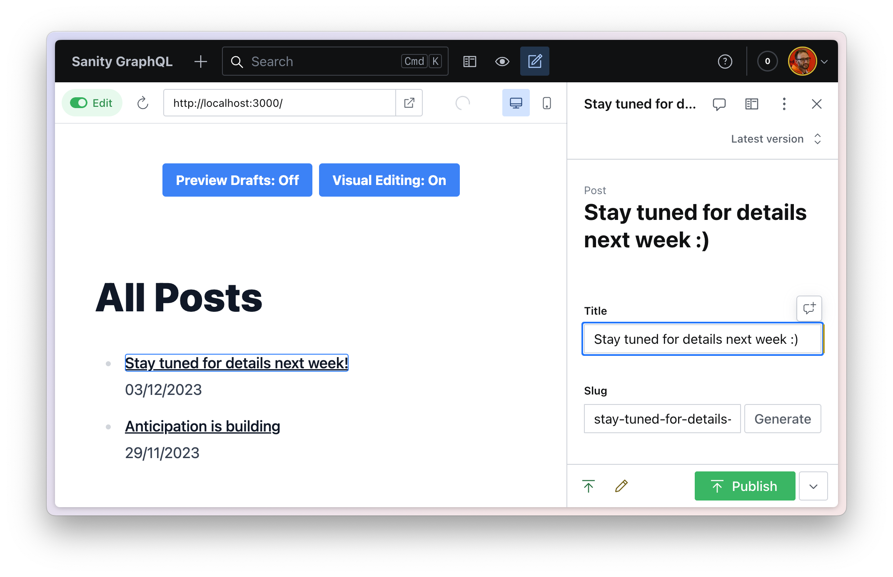

# Sanity Studio, Presentation and GraphQL

## Code example from guide

This repository contains the final code examples from the (currently private) accompanying guide on [how to set up Visual Editing with Sanity Studio, Presentation and GraphQL](https://www.notion.so/sanityio/Visual-Editing-with-GraphQL-62785c77665e4d5e80a0590f6ded5ab3).

## How it works

This code and the guide demonstrate how to perform a GraphQL request with a perspective to retrieve drafts and a request for the content source map to encode paths from content back to the Sanity Studio.

It also shows how to toggle the perspective and visual editing by modifying a cookie in the Remix application.

### TODO:

- [ ] Integrate Presentation with the front end so that the perspective is controlled by the Presentation tool, not because of a cookie value
- [ ] Integrate Presentation so that the content source map is requested because the site is being loaded in an iframe, not because of a cookie value
- [ ] Update the guide and this code example to remove the need for cookie handling

## Front-end only examples without Studio or Presentation

See also this example of [Sanity](https://sanity.io/docs), [GraphQL](https://www.sanity.io/docs/graphql), [Content Source Maps](https://www.sanity.io/docs/content-source-maps), [stega encoding and @sanity/overlays](https://www.sanity.io/docs/loaders-and-overlays#61bb7e7fb8fe):

- [Demo in Vite](https://github.com/SimeonGriggs/sanity-graphql-csm/tree/main)
- [Demo in Remix](https://github.com/SimeonGriggs/sanity-graphql-csm/tree/remix)
